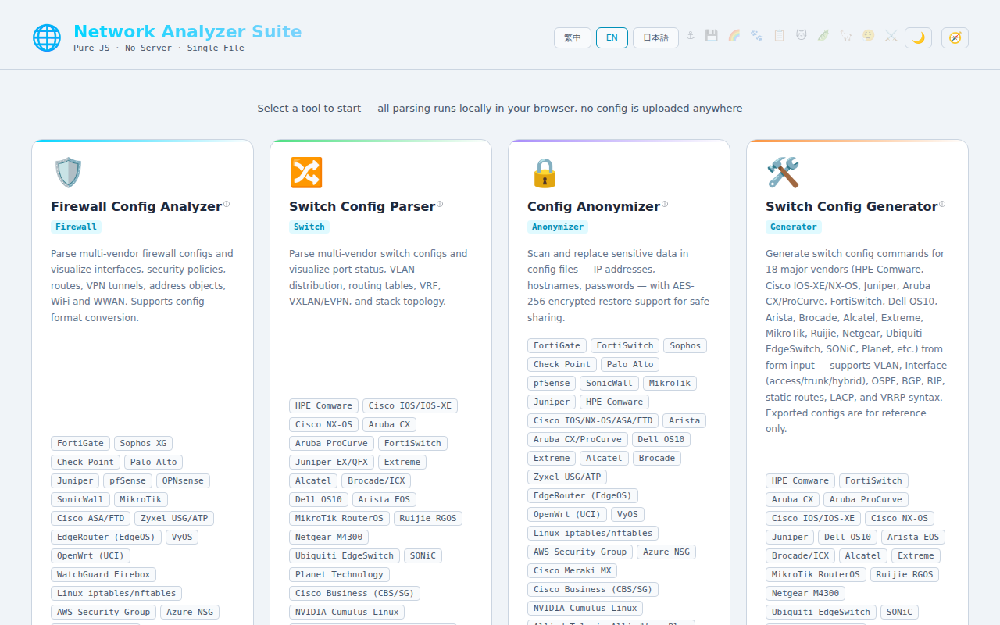
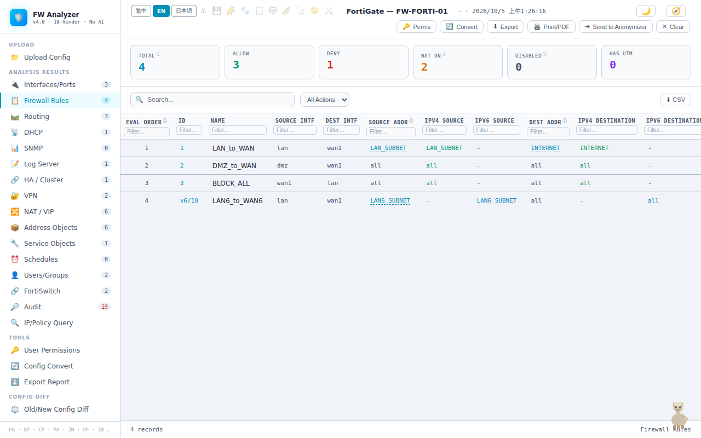
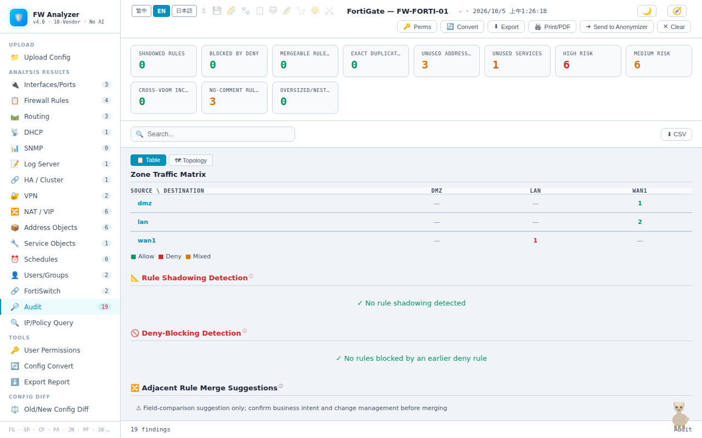
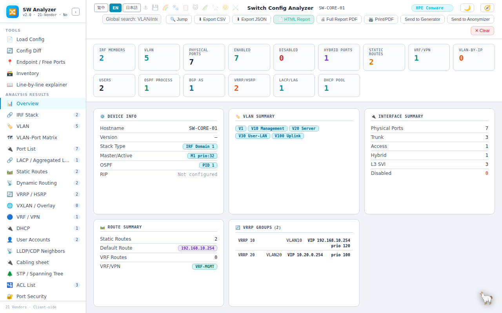
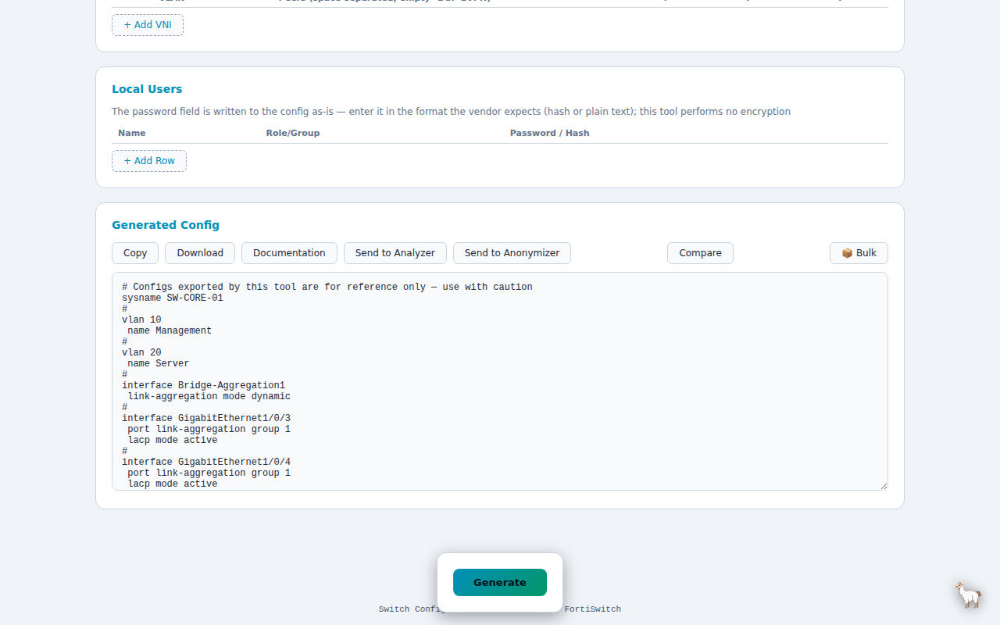
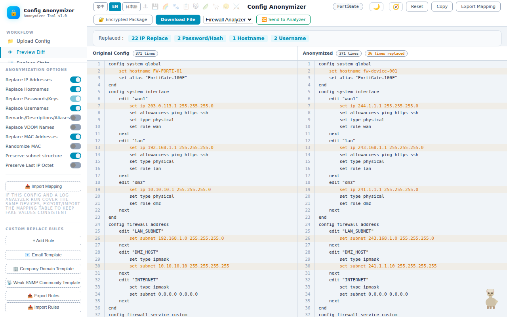
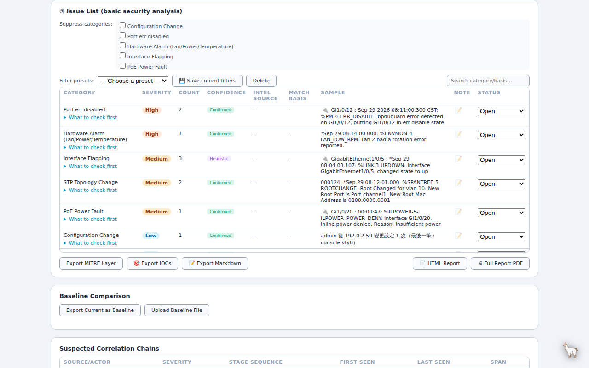

# 🦙 Alpaca Network Toolkit

[繁體中文](README.md) | **English**

Browser-based tools for parsing, anonymizing, comparing and generating multi-vendor firewall and switch configurations, plus a log analyzer. Plain front-end JavaScript that works offline after download.

> 🔒 **All parsing and processing happens locally in your browser. Configuration files and logs are never uploaded to any server.**

## Quick start

- **Use online (no download)**: https://s200070221.github.io/alpaca-network-toolkit/
- **Use offline**: download the whole repository, open `network-analyzer.html` in your browser and drop a config file or log onto it. The vendor is detected automatically and the matching tool opens.

## Tools at a glance

| Tool | What it does |
|---|---|
| 🌐 [Entry Page](#-entry-page) | Drop a file; the vendor is detected and the matching tool opens |
| 🛡️ [Firewall Config Analyzer](#️-firewall-config-analyzer) | Review rules, find which rule matches an IP/port, audit with a health score |
| 🔀 [Switch Config Parser](#-switch-config-parser) | Review ports, VLANs, routing and stack topology; security audit and cabling sheet |
| 🛠️ [Switch Config Generator](#️-switch-config-generator) | Generate switch configs from a form, or import an existing config to edit |
| 🔒 [Config Anonymizer](#-config-anonymizer) | Mask IPs, user names, passwords and other sensitive data before sharing a config |
| 📜 [Log Analyzer](#-log-analyzer-experimental) 🧪 | Sort logs by severity, flag likely problems, anonymize |

## 🌐 Entry Page

`network-analyzer.html`

- Drop config files or logs; the vendor is detected and the matching tool opens. Several files can be dropped at once.
- "Anonymize & Analyze" masks sensitive data first, then sends the result to the analysis tool.
- Collects each tool's latest analysis results and can download a combined health report.

## 🛡️ Firewall Config Analyzer

`firewall-analyzer-fixed.html` + `firewall-analyzer-*.js`

**Supported sources (19)**
- FortiGate, Sophos XG, Check Point, Palo Alto, Juniper SRX, pfSense, OPNsense, SonicWall, MikroTik, Cisco ASA / FTD, Zyxel USG / ATP, WatchGuard Firebox, H3C SecPath
- EdgeRouter (EdgeOS), VyOS, OpenWrt (UCI), Linux iptables / nftables
- Cloud: AWS security groups, Azure NSGs, Cisco Meraki MX (API response JSON)

**Main features**
- Visualizes rules, routes, NAT, VPN and address objects
- IP/port lookup: which rule allows or blocks a given connection
- Shadowed-rule analysis, compliance audit and health score
- Old-vs-new config comparison (including HA primary/secondary), conversion between config formats
- Rule hit-count import (FortiGate, Cisco ASA / FTD, Palo Alto, Juniper SRX) to find rules never hit or not hit for a long time

## 🔀 Switch Config Parser

`switch-config-parser.html` + `switch-analyzer-*.js`

**Supported vendors (22)**
- H3C Comware, HPE Comware, Cisco IOS-XE, Cisco NX-OS, Cisco Business (CBS / SG), Aruba CX, Aruba ProCurve, Juniper EX / QFX, Arista EOS, Dell OS10
- FortiSwitch, Extreme, Alcatel OmniSwitch, Ruckus-Brocade ICX, MikroTik RouterOS, Ruijie RGOS, Netgear M4300, Ubiquiti EdgeSwitch, Planet, Allied Telesis AlliedWare Plus
- SONiC, NVIDIA Cumulus Linux (NVUE)

**Main features**
- Visualizes ports, VLANs, routing and stack topology
- Security audit with a health score, config comparison
- Cabling sheet and endpoint lookup (paste MAC / ARP tables to find which port a device is on)

## 🛠️ Switch Config Generator

`switch-config-generator.html` + `switch-generator-*.js`

**Supported vendors (19)**
- H3C Comware, HPE Comware, Cisco IOS-XE, Cisco NX-OS, Aruba CX, ProCurve, Juniper, Arista, Dell OS10, FortiSwitch
- Brocade ICX, Alcatel, Extreme, MikroTik RouterOS, Ruijie, Netgear, EdgeSwitch, Planet, SONiC

**Main features**
- Generate configs from a form: VLANs, interfaces, IPv6, secondary IPs, OSPF / OSPFv3, BGP, VRRP, ACL, QoS, stacking and more
- CSV batch generation for many devices, template library
- Import an existing config into the form (or receive it directly from the Switch Config Parser)

## 🔒 Config Anonymizer

`config-anonymizer.html`

- Supports 35 firewall / switch / cloud config formats
- Consistently replaces IPs, hostnames, user names, passwords, keys, SNMP communities, MAC addresses and more; IPv4 and IPv6 supported
- Optional subnet preservation: addresses in the same subnet map to the same fake subnet, so lookups and routing results stay the same after anonymization
- Checks that the config structure is unchanged after anonymization
- The mapping table can be saved encrypted with AES-256 and restored later

## 📜 Log Analyzer (experimental)

`log-analyzer.html`

**Supported formats**
- CEF, LEEF, Syslog (RFC3164 / RFC5424), JSON
- Firewalls: FortiGate key=value, Cisco ASA, Juniper SRX RT_FLOW, H3C SecPath session / filter logs, MikroTik, Linux iptables / nftables LOG
- Network devices: Cisco IOS and Comware device logs
- Servers and cloud: Windows event XML and Sysmon, IIS / web access logs, AWS VPC / Azure NSG flow logs

**Main features**
- Sorts by severity and flags likely problems: frequency anomalies, scans, authentication failures, Kerberoasting, lateral movement, interface problems, MAC flapping, multi-stage attack chains and more, tagged with MITRE ATT&CK IDs
- Local threat-intel and ASN list matching (no network access)
- Anonymization of sensitive fields, CSV and report export
- Send an event to the Firewall Analyzer to find the matching rule; send an interface problem to the Switch Config Parser to view that port

`fetch_threat_intel.ps1` is an optional helper that downloads public blocklists outside the browser and merges them into one file for import; the tool itself stays offline.

## User guides

Detailed guides are in `docs/` (.docx, currently in Traditional Chinese only):

- [Firewall Config Analyzer](docs/firewall-analyzer-guide.docx)
- [Switch Config Parser](docs/switch-config-parser-guide.docx)
- [Switch Config Generator](docs/switch-config-generator-guide.docx)
- [Config Anonymizer](docs/config-anonymizer-guide.docx)
- [Log Analyzer](docs/log-analyzer-guide.docx)
- [Entry Page](docs/network-analyzer-guide.docx)
- [Tool integration guide](docs/tool-integration-guide.docx): how the tools hand data to each other (for example, sending a log event to the Firewall Analyzer to find the matching rule) and what to prepare for each

## Download notes

- Some tools consist of an `.html` file plus several `.js` files. **Keep the `.js` files in the same folder as the `.html` file** when downloading or sharing; a single `.html` file on its own will not work, so downloading the whole repository is recommended.
- For a true single-file version (for example, to send as one attachment), run `build-standalone.ps1`; merged files are written to `dist/`.
- The UI is available in Traditional Chinese, English and Japanese (plus several hidden easter-egg languages).

## License and usage restrictions

This repository does **not** grant any open-source license. Content is provided for viewing and personal evaluation only. Copying, modification, redistribution and commercial use are **not permitted** without explicit permission from the author.

## Disclaimer

All configuration text exported or generated by these tools is for reference only. Review and verify it carefully before applying it to any device; you use it at your own risk.
