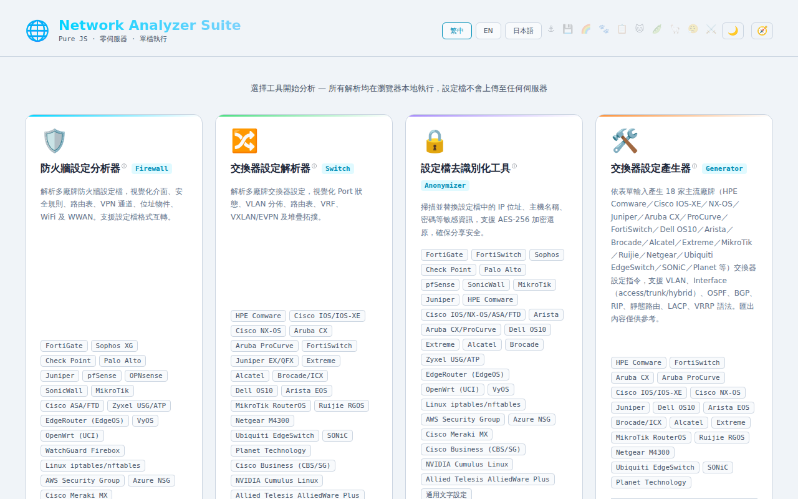
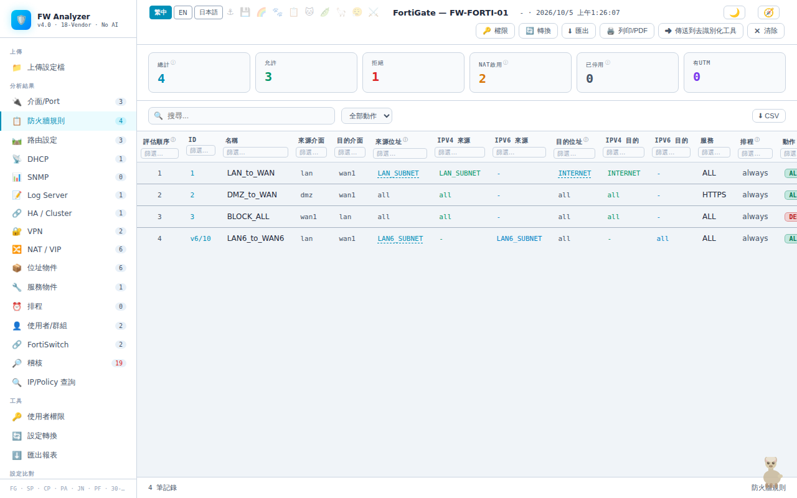
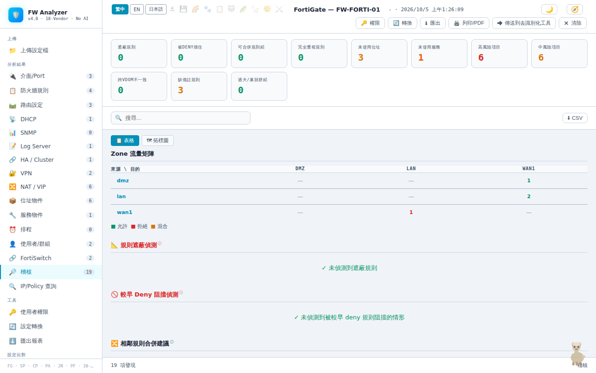
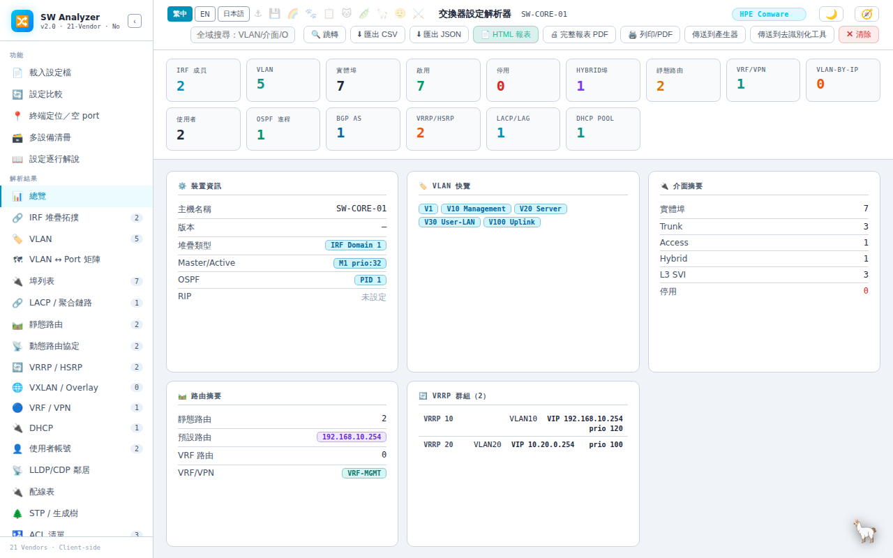
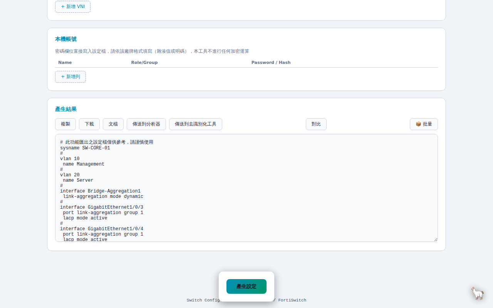
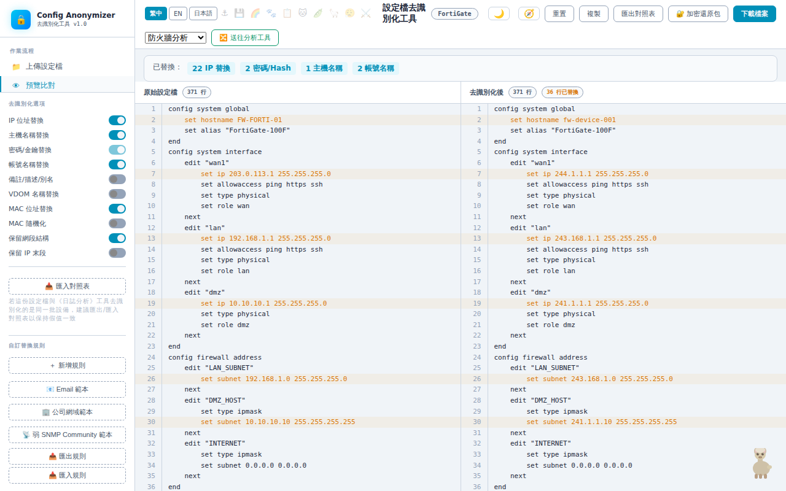
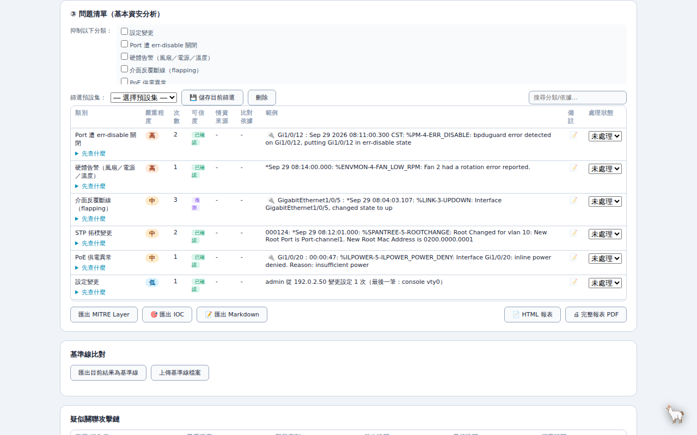

# 🦙 Alpaca Network Toolkit（羊駝網管工具包）

**繁體中文** | [English](README.en.md)

多廠牌防火牆／交換器設定檔的解析、去識別化、比對與產生工具組，另含 log 分析。純前端 JavaScript，下載後可離線使用。

> 🔒 **所有解析與運算都在瀏覽器本機完成，設定檔與 log 不會上傳到任何伺服器。**

## 快速開始

- **線上使用（免下載）**：https://s200070221.github.io/alpaca-network-toolkit/
- **離線使用**：下載整個 repo，用瀏覽器開啟 `network-analyzer.html`，把設定檔或 log 拖進去，會自動判斷廠牌並開啟對應工具。

## 工具一覽

| 工具 | 用途 |
|---|---|
| 🌐 [入口頁](#-入口頁) | 拖放檔案，自動判斷廠牌並開啟對應工具 |
| 🛡️ [防火牆設定分析器](#️-防火牆設定分析器) | 檢視規則、查詢 IP／埠會命中哪條規則、稽核與健康度評分 |
| 🔀 [交換器設定解析器](#-交換器設定解析器) | 檢視埠、VLAN、路由、堆疊拓撲，安全稽核與配線表 |
| 🛠️ [交換器設定產生器](#️-交換器設定產生器) | 用表單產生交換器設定，或匯入既有設定修改 |
| 🔒 [設定檔去識別化工具](#-設定檔去識別化工具) | 分享設定檔前遮蔽 IP、帳號、密碼等敏感資訊 |
| 📜 [Log 分析工具](#-log-分析工具實驗中) 🧪 | 依嚴重程度整理 log、找出可能問題、去識別化 |

## 🌐 入口頁

`network-analyzer.html`

- 拖放設定檔或 log，自動判斷廠牌並導向對應工具；可一次拖放多個檔案。
- 可選擇「去識別化後分析」：先遮蔽敏感資訊，再送到分析工具。
- 彙整各工具最近的分析結果，可下載綜合健檢報告。

## 🛡️ 防火牆設定分析器

`firewall-analyzer-fixed.html` ＋ `firewall-analyzer-*.js`

**支援來源（18 種）**
- FortiGate、Sophos XG、Check Point、Palo Alto、Juniper SRX、pfSense、OPNsense、SonicWall、MikroTik、Cisco ASA／FTD、Zyxel USG／ATP、WatchGuard Firebox
- EdgeRouter（EdgeOS）、VyOS、OpenWrt（UCI）、Linux iptables／nftables
- 雲端：AWS 安全群組、Azure NSG、Cisco Meraki MX（API 回應 JSON）

**主要功能**
- 規則、路由、NAT、VPN、位址物件視覺化
- IP／埠查詢：這條連線會被哪條規則放行或擋下
- 遮蔽規則分析、合規稽核與健康度評分
- 新舊設定比對（含 HA 主備比對）、設定檔格式互轉
- 規則命中數匯入（FortiGate、Cisco ASA／FTD、Palo Alto、Juniper SRX），找出從未或長期未命中的規則

## 🔀 交換器設定解析器

`switch-config-parser.html` ＋ `switch-analyzer-*.js`

**支援廠牌（22 家）**
- H3C Comware、HPE Comware、Cisco IOS-XE、Cisco NX-OS、Cisco Business（CBS／SG）、Aruba CX、Aruba ProCurve、Juniper EX／QFX、Arista EOS、Dell OS10
- FortiSwitch、Extreme、Alcatel OmniSwitch、Ruckus-Brocade ICX、MikroTik RouterOS、Ruijie RGOS、Netgear M4300、Ubiquiti EdgeSwitch、Planet、Allied Telesis AlliedWare Plus
- SONiC、NVIDIA Cumulus Linux（NVUE）

**主要功能**
- 埠、VLAN、路由、堆疊拓撲視覺化
- 安全稽核與健康度評分、設定比對
- 配線表、終端定位（貼上 MAC／ARP 表查設備接在哪個埠）

## 🛠️ 交換器設定產生器

`switch-config-generator.html` ＋ `switch-generator-*.js`

**支援廠牌（19 家）**
- H3C Comware、HPE Comware、Cisco IOS-XE、Cisco NX-OS、Aruba CX、ProCurve、Juniper、Arista、Dell OS10、FortiSwitch
- Brocade ICX、Alcatel、Extreme、MikroTik RouterOS、Ruijie、Netgear、EdgeSwitch、Planet、SONiC

**主要功能**
- 表單產生設定：VLAN、介面、IPv6、次要 IP、OSPF／OSPFv3、BGP、VRRP、ACL、QoS、堆疊等
- CSV 批次產生多台設定、設定模板庫
- 匯入既有設定檔帶入表單（也可從交換器設定解析器直接送過來）

## 🔒 設定檔去識別化工具

`config-anonymizer.html`

- 支援 35 種防火牆／交換器／雲端設定格式
- 一致性替換 IP、主機名稱、帳號、密碼、金鑰、SNMP community、MAC 等，IPv4／IPv6 皆支援
- 可保留網段結構：同網段換成同一個假網段，去識別化後的查詢與路由結果不變
- 檢查去識別化前後的結構是否一致
- 對照表可用 AES-256 加密保存，需要時還原

## 📜 Log 分析工具（實驗中）

`log-analyzer.html`

**支援格式**
- CEF、LEEF、Syslog（RFC3164／RFC5424）、JSON
- 防火牆：FortiGate key=value、Cisco ASA、Juniper SRX RT_FLOW、MikroTik、Linux iptables／nftables LOG
- 網路設備：Cisco IOS、Comware 設備 log
- 伺服器與雲端：Windows 事件 XML 與 Sysmon、IIS／Web 存取紀錄、AWS VPC／Azure NSG 流量紀錄

**主要功能**
- 依嚴重程度排序，找出可能問題：頻率異常、掃描、認證失敗、Kerberoasting、橫向移動、介面異常、MAC 飄移、跨事件攻擊鏈等，附 MITRE ATT&CK 編號
- 本機威脅情資與 ASN 清單比對（不連網）
- 敏感欄位去識別化、CSV 與報表匯出
- 事件一鍵帶到防火牆分析器反查規則；介面異常帶到交換器解析器查看該埠

`fetch_threat_intel.ps1` 為選用的輔助腳本，在瀏覽器外下載並合併公開黑名單供匯入，工具本身維持不連網。

## 使用說明文件

各工具的詳細說明在 `docs/`（.docx）：

- [防火牆設定分析器](docs/firewall-analyzer-guide.docx)
- [交換器設定解析器](docs/switch-config-parser-guide.docx)
- [交換器設定產生器](docs/switch-config-generator-guide.docx)
- [設定檔去識別化工具](docs/config-anonymizer-guide.docx)
- [Log 分析工具](docs/log-analyzer-guide.docx)
- [入口頁](docs/network-analyzer-guide.docx)
- [工具串接說明](docs/tool-integration-guide.docx)：工具之間如何交接資料（例如 log 帶到防火牆反查規則），以及各自需要的前置作業

## 下載與檔案說明

- 部分工具由 `.html` 加上多個 `.js` 檔組成，**下載或分享時請把 `.js` 檔和 `.html` 放在同一資料夾**，只複製 `.html` 會無法運作；建議直接下載整個 repo。
- 需要單一檔案版本（例如寄成一個附件）時，執行 `build-standalone.ps1`，會在 `dist/` 產生合併後的單檔。
- 介面支援繁體中文、English、日本語（另有多組隱藏彩蛋語言）。

## 授權與使用限制

本 repository **未提供任何開源授權（No License）**。原始碼與內容僅供瀏覽與個人評估使用，**不得複製、修改、再散布或用於商業用途**。如需授權使用，請聯繫作者。

## 免責聲明

本工具組匯出或產生的設定文字僅供參考，套用前請自行審閱並謹慎驗證，使用者需自行承擔風險。
